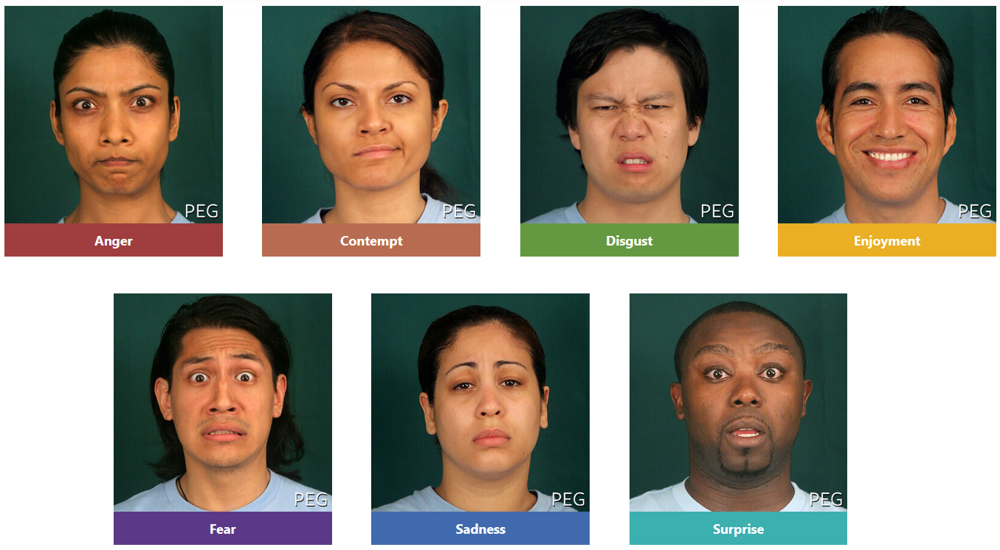
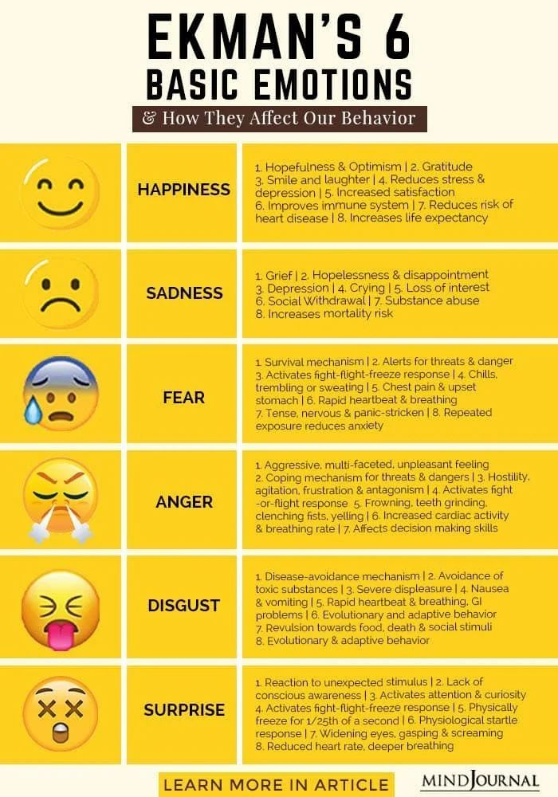
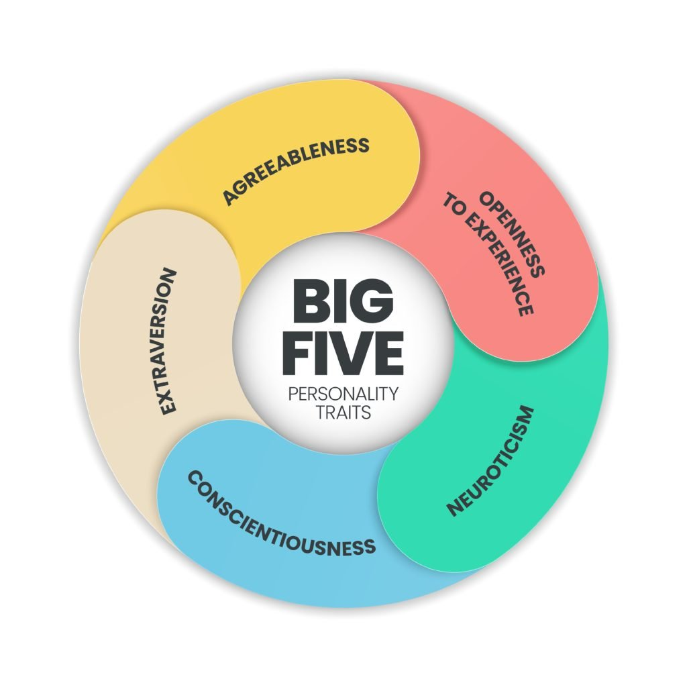

# PYC1511 - Landing Page

**Purpose:** The purpose of the module is to equip students with skills, knowledge, competencies, values and attitudes to the study of Psychology from an African perspective. The module serves as a theoretical basic foundation for further studies in psychology with an emphasis on understanding the broad fields of psychology as they emerge in Africa. The module will equip the learner with a holistic understanding of psychology and its past. The learner will have an introductory knowledge on how psychology has contributed to the power structures that legitimized inequalities in societies, particularly in Africa. The aim is also to enable the learner to understand, and embrace the African ways of knowing the human functioning. The module also enables the learner to distinguish between the African and the Western ways of thinking in terms of the philosophies that inform how people view the world.

***

**This unit deals** with psychology as the study of human behavior and how, owing to the geographic location of its origins, the knowledge created from its conceptualization continues to have consequences for African people.

### The origin of psychology in Africa

According to **Nsamenang** (2007), Euro-American psychology was introduced to Africa during the colonial period partly through Christian missionaries, visiting Western psychologists and Africans who were returning from universities abroad after being trained in conventional Western psychology.

From this world view, **psychology is defined as** the study of thought, emotions and observed behavior _(APA, 2015)_, emphasizing the “scientific” aspect of psychology.

**Nwoye** _(2015a, p. 104)_ defines psychology as the “_systematic and informed study of the complexities of human mental life, culture and experience in the pre- and post-colonial African world_”

Universities being established all over Africa

Universities in Africa were established following Africa’s colonial contact with Europe. Most of them started in the 1960s and 1970s after colonized countries gained political independence from their former colonizers, such as Britain, France, Belgium, Germany and Portugal. Some of the universities, like the University of Ibadan (Nigeria), the University of Ghana (Ghana), the University of Dar es Salaam (Tanzania), Makerere University (Uganda) and the University of Nairobi (Kenya), started as offshore colleges of the University of London, initially flying the flag of their “mother university” and offering various courses (including psychology) that were developed abroad and imported to Africa.


Referenced in UNIT 1


### Psychology and location

<mark style="color:red;">The word “</mark><mark style="color:red;">**psychology**</mark><mark style="color:red;">” is</mark> <mark style="color:red;"></mark><mark style="color:red;">**derived from Greek**</mark><mark style="color:red;">. The first part of the word comes from the Greek psychē, which refers to the</mark> <mark style="color:red;"></mark><mark style="color:red;">**soul**</mark><mark style="color:red;">; the second part comes from the Greek logos, which refers to</mark> <mark style="color:red;"></mark><mark style="color:red;">**studying a particular subject**</mark><mark style="color:red;">.</mark>

It could be concluded that psychology is **the study of the soul**.

Given that some people are in Africa, and Greece is in Europe, a few critical points need to be raised:

1. The first critical issue is that people’s location often determines their world view.

**A world view** can be defined as a set of **presumptions that particular people have about the world**. Their ideas can be about the world, God, life, death, love, how to heal sickness, their relationship with nature, and so on.

This concept is referred to as <mark style="color:red;">**epistemic location**</mark>. In terms of this concept, people generate their world views from a particular geopolitical context and qualify truths based on their positioning \
_(Mignolo, 2002)_.

Grosfoguel questions western psychology

Consequently, psychology is not value free but is informed by a cultural reference. In the same breath, _Grosfoguel_ (2013) questions why disciplines such as psychology are based on ideas and theories only from Western nations, thus questioning the contextual relevance and applicability of such theories in non-Western contexts.

2. The second critical point to examine is the idea of science informing the study of psychology.

**Science in psychology** implies a couple of things about the human psyche. It implies, for instance, that human behavior, emotions and thought can be studied objectively.

This can lead people to think about human beings in a mechanical way as though no other factors contribute to human behavior and may not reflect the complexities of society in informing human behavior.

3. Who decides what human processes are within the scope of psychology to study?

Why do they get to make this determination? \
On whose behalf do they make decisions? \
What are the consequences of developing a limited scope of studying psychology?

### Psychology in Egypt

Three significant events occurred in the 19th century that influenced the rise of psychology in Egypt (Ahmed, 1992)

1. The Al-Abssia Mental Health Hospital, the first mental hospital for Africa and the Arab world, was opened in Cairo in <mark style="color:green;">1880</mark>.
2. The newspapers and magazines distributed to the public paved the way for psychology in Egypt. These newspapers and magazines were established in Cairo and Alexandria, primarily by a group of immigrant Lebanese and Syrian journalists _(Ahmed, 2005)_.
3. Egypt started to expand its schooling system by establishing schools all over the country, including teachers’ schools, whose curriculum included some basic psychology training.

Sheikh Mohammed Sherif Saliem - Book

Sheikh Mohammed Sherif Saliem wrote and published books, including psychology books, in 1895. The book, <mark style="color:red;">Insanity</mark>, by Egyptian physician Mohammed Nagaty was published in 1891.

### Psychology in South Africa

In South Africa, it became perverted to fulfill a political purpose. As Marx (2013) notes, it was believed that the Bantu were not simply less developed than Europeans; rather, the belief was that their culture differed fundamentally from European culture and was incompatible with it.

University of Cape Town is established

Higher education in South Africa can be traced back to <mark style="color:green;">1829</mark>, when the South African College (later the University of Cape Town) was established in Cape Town (Cooper & Nicholas, 2012). This college prepared students for matriculation and examinations at the University of London.

University of Good Hope

In <mark style="color:green;">1873</mark>, the University of Good Hope was established as an examining body for degrees conferred in South Africa

University Act of South Africa

In 1916, the University Act of South Africa launched the University of South Africa, the University of Stellenbosch and the South African Native College (later the University Fort Hare).

Psychology was taught in philosophy departments until <mark style="color:green;">1917</mark>

RW Wilcocks (1892– 1967) was appointed as Professor of Logic and Psychology at the University of Stellenbosch after he had received his doctorate in the analysis of productive thought at the University of Berlin in <mark style="color:green;">1917</mark>

He established the first experimental psychology laboratory modeled on Wundt’s laboratory at the University of Stellenbosch (Louw & Foster, 1991).

First black ...

Chabani N Manganyi became the first black psychologist in <mark style="color:green;">1965</mark> and established the Department of Psychology at the University of Transkei in <mark style="color:green;">1976</mark> (now Walter Sisulu University).&#x20;

Josephine Naidoo was the first black person to apply for South African Psychological Association membership.&#x20;

Sathasivan Cooper, who frequently met with political activists, such as Steve Biko, Harry Nengwekhulu and Strini Moodley, helped to establish the Black Consciousness philosophy and was instrumental in the formation of the student’s representative council (SRC) at the University College. His political ideologies later led to his suspension from university in <mark style="color:green;">1969</mark>. He steered the merger with the University of Natal to form what is now known as the University of KwaZulu-Natal.

### Psychology in Zambia

In a study of reasoning in specific non- language-based school examination tasks, it was discovered that poor performance in the tasks was related to socioeconomic background and thus to familiarity with and acquired skills in dealing with the information presented as pictures (Okonji, 1971). This meant that psychology and its methodological applications had to be redefined to fit the context.

From this section, one gathers that the “how” and the “where” that inform the definition of psychology are crucial to how the study of psychology becomes an extension of oppressive political systems like colonization, apartheid and imperialism.

***

### Current Summary

> PYC1511 is an introduction to psychology course that aims to equip students with knowledge and skills from an African perspective. Psychology originated in Europe but was introduced to Africa during colonialism by missionaries, visiting psychologists, and Africans educated abroad. However, Western psychology does not fully capture the African experience and worldview. The development of psychology differed in various African countries based on their colonial influences and local conditions. For example, the first mental hospital in Africa was opened in Cairo in 1880, while psychology was taught in philosophy departments in South Africa until 1917 when the first experimental psychology lab was established

***

### The different areas in the development of psychology in Africa

<mark style="color:red;">Psychology as a discipline is concerned with the mind and behavior</mark> (Holt et al., 2019)

The mind, in this instance, refers to internal processes such as cognition or emotional states, whereas behavior refers to the outward manner in which these inward processes manifest.

Basic, or general, psychology is the study of the different factors that shape an individual’s personality, learning, cognition and so forth.&#x20;

Basic psychology includes:

1. Abnormal psychology,&#x20;
   1. **Abnormal psychology** is a branch of psychology that studies unusual patterns of behavior, emotion and thought considered to be maladaptive and disruptive to an individual’s life.
   2. **Psychopathology**, which is similar to abnormal psychology, refers to **the study of mental illness**, mainly by psychologists and psychiatrists to reach a medical understanding of the disease process
2. Behaviorism,&#x20;
   1. According to **behaviorism**, all things that organisms do – including acting, thinking and feeling – can and should be regarded as behavior and psychological disorders are best treated by altering behavior patterns or modifying the environment.
3. Biological psychology,&#x20;
   1. **Biological psychology**, or bio-psychology, specializes in the mind–body connection, especially how the nervous system affects behavior (Britannica, 2020).
4. Cognitive psychology,&#x20;
   1. **Cognitive psychology** involves the study of cognition, including mental processes underlying perception, learning, problem-solving, reasoning, thinking, memory, attention, language and emotions.
5. Comparative psychology,&#x20;
6. Cross-cultural psychology,
   1. **Cross-cultural psychology** refers to the scientific study of human behavior and mental processes under diverse cultural conditions
7. Developmental psychology,&#x20;
   1. **Developmental psychology** is concerned with studying humans throughout the various life stages. It explores physical, emotional and social development to give a complete picture of human development through the entire lifespan (APA, 2015)
8. Evolutionary psychology,&#x20;
   1. **Evolutionary psychology** explains traits and processes such as memory, perception and language in terms of humans having to adapt to an evolving environment.
9. Experimental psychology,
   1. **Experimental psychology** represents a methodological approach to psychology and refers to the use of experiments to understand human and animal participants’ sensation, perception, memory, cognition, learning, motivation, emotion and developmental processes, as well as social issues.
10. Neuropsychology,&#x20;
    1. **Neuropsychology** involves the study of the structure and the functions of the brain in relation to specific psychological processes and overt behaviors (Gluck, Mercado & Meyers, 2016).
11. Personality psychology,&#x20;
    1. **Personality psychology** as a field investigates characteristics that all people have that shape their thoughts, feelings and behavior (Young, 2020). <mark style="color:red;">The Big 5 personality model is often used to describe individual differences in people</mark>.
12. Positive psychology,&#x20;
13. Psycho-dynamic psychology,&#x20;
14. Quantitative psychology,
15. Social psychology.
    1. **Social psychology** studies social behavior and mental processes that pertain to social behavior. It is concerned with how humans think about and relate to one another. Social psychologists study topics such as conformity, the effect of persuasion on human behavior, beliefs, attitudes and stereotypes.

There are mainly **three historical phases of development, namely**:

1. **Demonology** (i.e., caused by evil forces)
   1. Demonology is the theory that **the devil** or another evil entity can reside inside a person and exert a mental influence over that person.
   2. In the fifth century BC, **Hippocrates** _(460–377)_ rejected the Greek belief that the gods sent serious physical diseases and mental disturbances as punishment. He believed that illnesses were caused naturally.
2. **Somatogenesis** (i.e., bodily causes)
   1. States that something wrong with the soma, or the physical body, disturbs thoughts and actions.
3. **Psychogenesis** (i.e., psychological or mental causes).

### **Hippocrates classified mental disorders into**:

1. Mania
2. Melancholia
3. Phrenitis
4. Brain fever

He believed that normal brain functioning, also known as mental health, depended on a delicate balance of **four main fluids in the body**:

1. Blood
2. Black bile
3. Yellow bile
4. Phlegm

Hippocrates helped identify 

His documented work led to information that is used to identify symptoms of **epilepsy**, **alcoholic delusion**, **stroke** and **paranoia** (Davidson et al., 2004, p. 7)

Asylums, Universities and Historic figures 

Most hospitals were used for the treatment of leprosy (Davidson et al., 2004).&#x20;

These facilities were converted to asylums around <mark style="color:green;">1547</mark> in England. Patients who were admitted to these types of hospitals were seen as a burden to society and locked away in desolate circumstances.&#x20;

In <mark style="color:green;">1883</mark>, Emil Kraepelin (1856–1926) published a classification system that could be used to establish the biological nature of mental illness.&#x20;

He discerned among mental disorders a tendency for certain groups of symptoms, or syndromes, to appear together, which could consequently be regarded as underlying physical causes of particular medical diseases.&#x20;

He regarded each mental illness as distinct from others, having its own origins, symptoms, course and outcome.&#x20;

The somatogenic explanation for mental illness dominated the field well into the 20th century. However, other researchers, especially in France and Austria, attributed mental disorders to psychological malfunction. Among these researchers was Franz Anton Mesmer (1734–1815), an Austrian physician practising in Vienna, who was one of the earliest practitioners of modern-day hypnosis. The word “mesmerise” is an older term for “hypnotise” (Davidson et al., 2004)

Pavlov and his dogs

Ivan Pavlov (1849–1936) was one of the pioneers of behaviorism.&#x20;

Pavlov, a Russian physiologist, carried out studies on the function of heart nerves, primary digestive glands and conditioned responses, that is, classical conditioning.&#x20;

His studies on primary digestive glands accidentally showed results of conditioned responses.&#x20;

While doing research about the function of juices secreted by dogs when given food, he noticed that dogs began to salivate even when they were not waiting for food.&#x20;

Dogs would salivate on seeing their keepers or even hearing their keepers’ footsteps. Pavlov found that dogs’ reflexes were stirred by other events happening at the same time as the real stimulus. Pavlov was interested in behavior displayed by organisms against stimulus.

In <mark style="color:green;">1913</mark>, John Broadus Watson (1878–1958) wrote an article, “<mark style="color:red;">Psychology through the eyes of a behaviorist</mark>”, in which he stated that the science of psychology deals with observable behaviors and not phenomena such as conscience or thought.

It was only after Watson’s article that **behaviorism was delineated into three phases**:

1. The first phase, namely, Watson’s behaviorism lasted until 1930.
2. The second phase, namely, new-behaviorism comprised studies by Edward Tolman, Edwin Guthrie, Clark Hull and BF Skinner and lasted until the 1960s. In this phase, behaviorists claimed that
   1. The base of psychology was composed of studies about learning
   2. Behaviors could be explained by principles of conditioning
   3. psychology had to comply with the principle of functionalism and if a concept could not be defined functionally, it could not be studied either.

The third phase, called new-new behaviorism or social behaviorism, included cognitive elements. This phase was pioneered by Bandura and Rotter. Canadian-American psychologist Albert Bandura (1925–2021) first named his theory social behaviorism and then renamed it social cognitive theory.

There are **two general kinds of behaviorists,** namely:

1. **Radical** (Watson and Skinner)
   1. Radical behaviorists believe that psychology should study observable behaviors and environmental processes
2. **Methodological** (Bandura and Rotter)
   1. Methodological behaviorists believe that cognitive processes should be included when studying methods of behavior.

When Biological psychology came into being 

It came into being in 1913, following researcher Hideyo Noguchi’s discovery of the bacterium responsible for syphilis in the brain of a deceased patient. This discovery led to an investigation into the relationship between physiology and psychological health (Durfee, 2005).

Cross-cultural psychology and Paul Eckmans research

The discipline grew in the <mark style="color:green;">1960s</mark> in order to explain disparities in topics such as affect, cognition, conceptions of self, psychopathology, anxiety and depression.&#x20;

Researchers such as Paul Eckman (born in 1934) examined facial expressions or emotions of participants from ten different cultures. The results showed that some facial expressions are universal.

### Ekman's 6 basic emotions

<figure><figcaption>
Universal facial expressions
</figcaption></figure>

<figure><figcaption></figcaption></figure>



***

### Summary

Paul Ekman, a renowned psychologist, identified six basic emotions that he suggested were universally experienced in all human cultures. **Here are Ekman's six basic emotions**:

1. **Happiness**: This is generally expressed through laughter, smiles, and uplifting body language. It's associated with joy, satisfaction, contentment, and pleasure.
2. **Sadness**: This emotion is often shown through quietness, low energy, and downcast body language. It's associated with feelings of loss, helplessness, disappointment, or sorrow.
3. **Fear**: This emotion triggers a 'fight or flight' response and is typically associated with a perceived threat or danger. It can be expressed through widened eyes, increased heartbeat, and body tension.
4. **Disgust**: This emotion is a response to something unpleasant or offensive, such as a bad smell, taste, or a morally reprehensible act. It's often expressed through a wrinkled nose, closed eyes, and an open mouth.
5. **Anger**: This emotion is a response to frustration, threat, or injustice. It can be expressed through furrowed eyebrows, a grimacing face, and aggressive body language.
6. **Surprise**: This is a brief emotion often elicited by an unexpected event. It's usually expressed through raised eyebrows, wide eyes, and an open mouth.

These emotions are considered 'basic' because they are thought to be innate, not learned, and are experienced universally across cultures.

Rhyme to remember

When you're **happy**, you're laughing with glee,\
**Sadness** is like a fallen tree.\
**Fear** is a haunted house at night,\
**Disgust** is a smell that gives you a fright.

**Anger** is a traffic jam, so tight,\
**Surprise** is a gift that takes flight.\
Six emotions, all in a row,\
With this rhyme, you'll always know.

***

Developmental psychology started

Developmental psychology as a discipline started as a philosophical field with John Locke (1632– 1704) and Jean-Jacques Rousseau (1712–1778).&#x20;

Locke stated that a child is a tabula rasa, or a blank slate, on which experience writes. Rousseau was the first to argue that a child grows in stages.&#x20;

Baby biographies, that is, descriptive accounts of children’s development were first created in 1787 by German philosopher Dietrich Tiedemann (1748–1803).&#x20;

A century later, German biologist Wilhelm Preyer (1841– 1897) documented the first four years of his son’s life and published Die seele des kindes (The mind of the child) in <mark style="color:green;">1882</mark>.

**Evolutionary psychology**: Historically, Charles Darwin’s (1809–1882) theory of natural selection provides the basis for an understanding of evolution.

### Experimental psychology

Wilhelm Wundt (1832–1920) founded the first laboratory for experimental psychology in Leipzig, Germany.&#x20;

Charles Bell (1774–1842), a British physiologist, did research on the nervous system and Ernst Heinrich Weber (1795–1878), a German physicist, suggested that judgements of sensory differences are relative, not absolute.&#x20;

This led to **Weber’s law**, which is considered the **first quantitative law in the history of psychology**.

### Neuropsychology

The first textbook on neuropsychology, <mark style="color:red;">Fundamentals of human neuropsychology</mark>, was published by Kolb and Whishaw (Finger, 2000).&#x20;

Although this is a recent textbook, the history of the field can be traced back to the third dynasty of ancient Egypt. Imhotep, an Egyptian priest, first wrote about a scientific approach to medicine and disease and described the brain, trauma, abnormalities and remedies (Finger, 2000).&#x20;

As the field of medicine developed its understanding of human anatomy and physiology, different theories developed to understand why the body functions the way it does

***

The basic psychological methods are used in applied psychology to solve issues of behavior and experience.

Hugo Münsterberg (1863–1916), a German-American psychologist, pioneered applied psychology, extending his research and theories to industrial/organizational, legal, medical, clinical, educational and business contexts (Hergenhahn, 2005).

### **Types of applied psychology include**:

1. **Clinical psychology**,&#x20;
   1. A branch of psychology focused on the diagnosis and treatment of mental disorders and psychological distress.
2. **Community psychology**,&#x20;
   1. A field within psychology that examines how individuals relate to their communities and the reciprocal effect of communities on individuals.
3. **Consumer psychology**,&#x20;
   1. The study of why people buy goods and services, focusing on their thoughts, feelings, perceptions, and behaviors
4. **Counseling**,
   1. A professional guidance of the individual by utilizing psychological methods, especially in collecting case history data, using various techniques of the personal interview, and testing interests and aptitudes
5. **Critical psychology**,&#x20;
   1. An approach to psychology that challenges mainstream psychology and attempts to apply psychological understandings in more progressive ways
6. **Educational psychology**,&#x20;
   1. The study of how people learn in educational settings, the effectiveness of educational interventions, and the psychology of teaching
7. **Environmental psychology**,&#x20;
   1. A field of psychology that examines the relationship between people and their physical environment
8. **Ergonomics,**&#x20;
   1. The scientific study of people and their working conditions, especially done to improve effectiveness
9. **Food psychology**,&#x20;
   1. The study of the mental and emotional relationship between people and food
10. **Forensic psychology**,&#x20;
    1. The intersection between psychology and the justice system, involving understanding fundamental legal principles and providing expert psychological opinions
11. **Health psychology**,&#x20;
    1. The study of how biological, social, and psychological factors influence health and illness
12. **Humanistic psychology**,&#x20;
    1. A perspective that emphasizes looking at the whole individual and stresses concepts such as free will, self-efficacy, and self-actualization.
13. **Industrial/organizational psychology**,&#x20;
    1. Applies psychological principles and research methods to the workplace to improve productivity, health, and the quality of work life
14. **Legal psychology**,&#x20;
    1. Involves empirical, psychological research of the law, legal institutions, and people who come into contact with the law
15. **Medical psychology**,&#x20;
    1. Concerned with the diagnosis, treatment, and prevention of mental disorders, as well as research into the causes and consequences of these disorders
16. **Military psychology**,
    1. The research, design, and application of psychological theories and empirical data to understand, prevent, and mitigate the adverse effects of physical and emotional stress on military personnel
17. **Psychology of music**,&#x20;
    1. The study of how music affects and is processed by the individual, including the study of emotional response, perception, and cognitive processes related to music
18. **Occupational health**,&#x20;
    1. The field of public health that studies trends in illnesses and injuries in the worker population and proposes and implements strategies and regulations to prevent them
19. **Political psychology**,&#x20;
    1. An interdisciplinary academic field dedicated to understanding politics, politicians, and citizens from a psychological perspective
20. **Psychometric**,&#x20;
    1. Relating to the measurement of mental capabilities and processes - the science of measuring mental capacities and processes
21. **Psychology of religion**,&#x20;
    1. The application of psychological methods and interpretive frameworks to the diverse contents of religious traditions
22. **School psychology**,&#x20;
    1. A field that works within the educational system to help children with emotional, social, and academic issues
23. **Sport psychology**
    1. The study of how psychology influences sports, athletic performance, exercise, and physical activity
24. **Traffic psychology**
    1. The study of the behavior of road users and the psychological processes underlying that behavior

### Big 5

<mark style="color:red;">The Big 5 personality model is often used to describe individual differences in people:</mark>

<figure><figcaption>
Big 5
</figcaption></figure>

The Big Five Personality Model, also known as the Five-Factor Model, is a widely accepted psychological theory that classifies human personality traits into five broad dimensions. These dimensions are:

### OCEAN

1. **Openness to Experience**: This trait features characteristics such as imagination, insight, and a broad range of interests, as well as intellectual curiosity, creativity and a preference for novelty and variety.
2. **Conscientiousness**: This dimension includes traits like being organized, responsible, and reliable. Conscientious individuals show self-discipline, act dutifully, and aim for achievement.
3. **Extroversion**: This trait is characterized by excitability, sociability, talkativeness, assertiveness, and high amounts of emotional expressiveness. Extroverts gain energy from interacting with others.
4. **Agreeableness**: This personality dimension includes attributes such as trust, altruism, kindness, affection, and other prosocial behaviors. Agreeable people tend to be cooperative and considerate.
5. **Neuroticism**: Individuals with high neuroticism tend to experience emotional instability, anxiety, moodiness, irritability, and sadness

Each person has every trait to some degree, but in different levels, which makes up the unique personality profile.


Playlist of OCEAN


Rhyme to remember OCEAN

**Openness** is a curious delight,\
Imagination taking flight.

**Conscientiousness** is being keen,\
Organized and always clean.

**Extroversion** is a social dove,\
Thrives on crowds and acts of love.

**Agreeableness** is kind and true,\
Always there to help you through.

**Neuroticism**, a stormy sea,\
Emotions sway like a tree.

Five dimensions, each a guide,\
In our personalities, they reside.



### Different theoretical perspectives in the development of psychology in Africa

Psychologists in Africa continued to follow the principles and traditions of Western psychology. White psychologists in South Africa followed the script of Euro-American psychology in the sense that their theories and research studies informed their world view on racial classification and political duties.

Bulhan (1985) identifies the following **three ways in which Eurocentric psychology continued to manifest itself:**

1. **Assumptive solipsism**. Assumptive solipsism is the assumption that the Euro- American world view is the only or most significant world view
2. **Methodological solipsism**. Methodological solipsism is the assumption that positivism or neo-positivism is the only or best way to conduct scientific research
3. **Experiential solipsism**. Experiential solipsism is the assumption that middle-class white men’s experiences are the most valid

#### The forms of assumptive solipsism (adapted from Bulhan, 1985)

* **Control-prediction bias**
  * This bias is articulated in methodology when the control of variables and prediction are seen as necessities for scientific inquiry (seen in the research section). The idea is to control nature and to predict events before they happen. This led to social control and the oppression of others, especially since psychology functioned within colonial discourse.
* **Analytical-reductionist bias**
  * This bias is founded on the assumption that complex human experience is understood better when it is reduced to elemental and simple units. This bias is the result of psychology identifying with natural science, in terms of which complex human behavior is compromised, to be quantified (reduction-ism of behavior) and compared with the behavior of animals such as rats in experiments.
* **Trait-comparison bias**
  * According to this bias, the aim of psychology is to assess traits or abilities and to compare them with one another. These traits are seen as stable and not influenced by socio-historical determinants. Abilities are usually quantified and measured through IQ tests.
* **Stability-equilibrium bias**
  * This bias serves to maintain and exercise social control in order to further perpetuate the status quo. Stability is desirable, and conflict and change are not. This bias appeals to those who are part of the status quo and who are not in favor of change.

The word “**eugenics**” comes from the Greek word eugenes (eu, i.e., well and genos, i.e., born). The term refers to the study of methods of improving the human race through the bearing of healthy offspring (Garver & Garver, 1991). The eugenics movement became part of all the psychological developments in which racial classification was part of research processes and the testing of abnormal and expected behavior

Case Study: Black Insanity

In 1955, John Colin D Carothers (1903–1989), a colonial psychiatrist in Kenya, claimed that the brains of Africans were underdeveloped compared to those of whites. Mental health services were greatly influenced by colonization, homeland policies and the legislation of the apartheid regime in South Africa (Sukeri, Betancourt & Emsley, 2014).&#x20;

As early as 1875, asylums were opened in the Eastern Cape, South Africa, to accommodate individuals deemed “insane”. By then, racial segregation policies overlapped with the classification of patients according to social class, and “better- paying”, predominantly white patients were accommodated separately from violent, mostly black patients (Swartz, 1995). Furthermore, it was believed that in order for patients to recover, they needed to be separated by race and class for the recovery process, as well as to protect the feelings of white patients (Swartz, 1995; Sukeri, Betancourt & Emsley, 2014). Segregation did not only mean the separation of patients; it was also deemed degrading for white nurses to look after male patients who were perceived as violent and sexually aggressive. Racial differences influenced the diagnostic practices of practitioners, who maintained that black Africans and coloureds could not experience depression.&#x20;

Facilities were resourced differently; administrators rationalised the provision of accommodation, which posed a fire hazard and had poor sanitation, arguing that natives preferred to maintain their indigenous style of living (Swartz, 1995). As part of occupational therapy, black male patients performed manual labor, including garden and laundry services for the white asylums. Separate health services were made available in terms of the Public Health Act 36 of 1919. A hierarchy was established, with males being fed more than women, and whites more than Indians, coloureds and blacks. Subsequently, black patients were dying in numbers more than white patients. Wards were overcrowded; there was rarely any contact between black patients and their families, and the hospital staff did not speak the patients’ language, which made communication and thus the road to recovery difficult, with nurses giving little attention to the black patients.&#x20;

According to Vaughan (1991), asylum and psychiatric admissions indicate deculturation and the breaking down of barriers of difference and silence. “Individuals who had forgotten who they were and had ceased to conform to the notion of the African subject were the ones who often found themselves behind the walls of an asylum” (Vaughan, 1991, p. 125, as cited in Swartz, 2009). According to Dr Thomas Duncan Greenlees, a medical specialist at the asylum in Grahamstown, South Africa, civilisation and, thus, the mixing of the different cultures (i.e., civilisation) led to higher rates of insanity among black Africans. Black men and women who refused to confine themselves to the areas assigned to them were labelled insane; similarly, whites who disregarded their social status were labelled insane. As an example, Nontetha Nkwenkwe, a prophet, was confined for many years (1922–1935) in a psychiatric hospital for disrupting the regimes and disciplines of work on a white farm. The confinement of “insane” black patients was “less about curing them or alleviating their mental pain, but more about removing them as a source of disturbance to society” (Edgar & Sapire, 2000, p. 34). Female Africans (blacks) were rarely admitted to asylums, especially because most of them stayed far from cities or where they would be in close contact with whites. Therefore, admission into mental hospitals was generally restricted to those who were found “straying” or found in the “wrong place” (Jackson, 2005, p. 127). On the other hand, whites who were confined to psychiatric hospitals were the ones who had forgotten who they were and “gone native”. They failed to maintain civilized behavior and ended up as alcoholics or contracted sexually transmitted diseases (Swartz, 2009)

#### The emergence of African psychology (adapted from Nwoye, 2015b)

(i) The portrayal of African people in a negative light by Europeans&#x20;

(ii) The inability of Eurocentric psychological theories to explain the lives of African people pre- and post-colonization&#x20;

(iii) The publishing of dehumanizing scholarly research that concludes that African people have below-average intellectual ability; this research was used as a justification for slavery and a low standard of living for black people&#x20;

(iv) Psychological theory and research imitative of Western psychological theory, resulting in psychological theory that is irrelevant&#x20;

(v) Eurocentric psychology operates in an atomistic, mechanistic and reductionist fashion, providing the framework within which mental life is regarded

### The role of psychology in colonization and racial segregation
